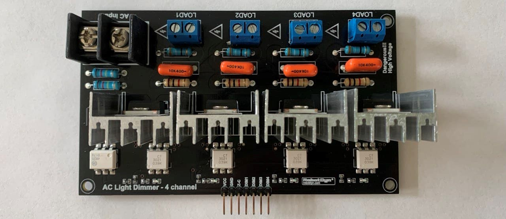

# 4ChannelBTA16TRIACControl
An integrated IoT (Internet of Things) solution for controlling 4-Channel BTA16 TRIAC Board. This project is part of [ProgrammableIoTEnvironmentChamber](https://github.com/JiaweiHe98/ProgrammableIoTEnvironmentChamber).

## Overview

### Web Dashboard

The gauges on the top show the current settings of each channel. The sliders below each gauge allow the users to assign new power level to each channel. We divided the power level into 1000 units. The line charts below the sliders help the users to monitor the history of the settings.

### Node-Red Flow

Node-Red is a visual programming tool based on Node.js. It allows us to use blocks and line to build our program. From the diagram above, the main steam is divided into 4 sub steams and each of them is in charge of one channel of the dimmer.

### 3D Printed Control Box

The box can be compatible with fans range from 40mm to 70mm. It prevents electric shock caused by human contact and effectively dissipate the heat generated by the controller. For each of the base piece and the cover piece, a perfectly plain surface is designed to make the 3D printing process easier.

### Dimmer


### Testing


I don't have enough LEDs. 

## Prepare for Developing
This section will guide you through the software and tools required for building this project.

### Visual Studio Code
Visual Studio Code, also known as VSCode, is a popular and powerful text editor for developers. A good text editor is crucial for speeding up the coding process and debugging process.

#### Install Visual Studio Code
We recommend to use the official website for downloading the packages.
Please go to [https://code.visualstudio.com/](https://code.visualstudio.com/) and follow the instruction on the web page.

#### Recommended Extensions
We recommend you to install the listed extensions for boosting your coding experience with VSCode
* Arduino
* C/C++
* Python
* vscode-icons

### Arduino IDE
Arduino IDE is a open-source integrated development environment designated for all Arduino boards. We will use this software to compile our code and burn it to our Arduino. It also has a serial monitor which allows us to interact with Arduino through serial communication.

#### Install Arduino IDE
We also recommend to use the official website for downloading the packages if you are on a Windows or MacOS machine.
Simply go to [https://www.arduino.cc/en/software](https://www.arduino.cc/en/software) and find out your version.
If you want to use a Raspberry Pi or a Linux machine to program the Arduino, you can simply update your software list by ```sudo apt-get update``` and install Arduino IDE by ```sudo apt-get install arduino``` in your console.

### Python
Python is a widely used program language and both python2 and python3 interpreters are pre installed into Raspberry Pi OS and MacOS.

#### Install Python3 for Windows
Go to [https://www.python.org/downloads/](https://www.python.org/downloads/) and choose the version you prefer. Don't forget to add PATH for python interpreter.

#### Install pyserial package
pyserial can be installed through command line with pip. Type ```pip install pyserial``` to add pyserial library.

### Node-Red
Node-Red is a visual programming tool based on Node.js. It allows you to edit working flows inside a web browser through a wide range of nodes and deploy your flow by simply click deploy button on the right top corner.

#### Install Node-Red
If you are using Raspberry Pi and you chose "Raspberry Pi OS with desktop and recommended software", Node-red is already installed into your Raspberry Pi. Simply click the start button on the top-left and go to programming tab. Then, you will able to find Node-Red.

If you are using a Windows machine, you first need to install Node.js and nmp. Go to [https://nodejs.org/](https://nodejs.org/) and download for Windows. Run the MSI file as administrator. Accept the default settings while installing. When finishing the installation, type ```node --version; npm --version``` in Powershell or ```node --version && npm --version``` in cmd to make sure that your installation is completed.

You should see something similar to this:
```
v14.15.3
6.14.9
```

Then, install Node-Red through ```npm install -g --unsafe-perm node-red``` and add ```node-red``` to your system path.

If you are using Linux, you can install Node-Red with npm, docker, or snap. You can follow the [Documentation](https://nodered.org/docs/getting-started/local) on Node-Red official website.

#### Install node-red-dashboard
To install the node-red-dashboard, click the Menu button on the top right and select Manage palette. Then search for node-red-dashboard and click install.

Or use ```npm i node-red-dashboard``` to install it in command line.

Use [http://localhost:1880/ui](http://localhost:1880/ui) to open the dashboard if it is on you local machine. Change the URL to your server if Node-Red is running on other devices.

## Start Developing

### Phase Angle Control
Phase Angle Control is also known as "Phase-fired control (PFC)". Its principle is to modulate a thyristor or a TRIAC to control the amount of voltage, current or power flow into the controlled systems. 

#### Rectified voltage curve through Phase Angle Control

This project uses a BTA16 TRIAC as the device for modulate the voltage. The TRIAC will be turned on when the pulse arrive and stays on until the voltage is flipped.

### Detect Zero-Crossing points
The Zero-Crossing Points are the exact time that the AC voltage reaches zero. We first need to use a full bridge rectifier to convert AC into DC. Then we will use a optocoupler to drop the voltage from 120V or 220V to around 5V, which allows us to use an Arduino to process the signal through digital input.

#### Hardware interrupt for Arduino
The kind of interrupt we are going to use is also known as external interrupts. However, not all of the pins on the Arduino support external interrupts. For Arduino UNO, only PIN2 and PIN3 and be used as external interrupt. You can check out [attachInterrupt() - Arduino Reference](https://www.arduino.cc/reference/en/language/functions/external-interrupts/attachinterrupt/) for more information.

#### Code for external interrupt
Syntax ```attachInterrupt(digitalPinToInterrupt(pin), ISR, mode)```

| Mode | Description |
| ------ | --------- |
| LOW | to trigger the interrupt when the pin is low |
| CHANGE | to trigger the interrupt when the pin state flips |
| RISING | to trigger the interrupt when state goes from low to high |
| FALLING | to trigger the interrupt when state goes from high to low |
| HIGH | to trigger the interrupt when the pin is high (only support Due, Zero, and MKR1000)


Code for this project:

```C
// Define the pin number as a variable will make the developing process easier and less likely to make mistakes
int zeroCrossing = 2; 

void setup() {
  // Initialize external interrupt
  attachInterrupt(digitalPinToInterrupt(zeroCrossing), sequenceStart, FALLING);
}
```

#### Firing pulse

We choose 115200 as the baud rate and 115200 is the highest rate that Arduino support. This will allow us to have a smaller lag when we assign new instructions. We will dive deeper into the serial connect in the next section.

#### Setup:
```C
  // opens serial port, sets data rate to 115200 bps
  Serial.begin(115200);    

  // Initialize input pin
  pinMode(zeroCrossing, INPUT);

  // Initialize output pin
  pinMode(ch1, OUTPUT);
  pinMode(ch2, OUTPUT);
  pinMode(ch3, OUTPUT);
  pinMode(ch4, OUTPUT);

  digitalWrite(ch1, LOW);
  digitalWrite(ch2, LOW);
  digitalWrite(ch3, LOW);
  digitalWrite(ch4, LOW);

  // Initialize hardware interrupt, start sequence
  attachInterrupt(digitalPinToInterrupt(zeroCrossing), timerReset, FALLING);
}

```

loop: For firing the pulse (BTA16 needs around 500ns of pulse to switch it on)

```C
void loop() {
  unsigned long timePassed = micros() - previousMicros;

  // ch1
  if (timePassed > timings[0] && timePassed < timings[0] + 500)
  {
    digitalWrite(ch1, HIGH);
  } else if (timePassed < timings[0] || timePassed > timings[0] + 500)
  {
    digitalWrite(ch1, LOW);
  }
  
  // ch2
  if (timePassed > timings[1] && timePassed < timings[1] + 500)
  {
    digitalWrite(ch2, HIGH);
  } else if (timePassed < timings[1] || timePassed > timings[1] + 500)
  {
    digitalWrite(ch2, LOW);
  }

  // ch3
  if (timePassed > timings[2] && timePassed < timings[2] + 500)
  {
    digitalWrite(ch3, HIGH);
  } else if (timePassed < timings[2] || timePassed > timings[2] + 500)
  {
    digitalWrite(ch3, LOW);
  }

  // ch4
  if (timePassed > timings[3] && timePassed < timings[3] + 500)
  {
    digitalWrite(ch4, HIGH);
  } else if (timePassed < timings[3] || timePassed > timings[3] + 500)
  {
    digitalWrite(ch4, LOW);
  }
}

```
We cannot use delay function inside the loop because we are controlling four different channels at the same time. The delay function will tied up the CPU so that other instruction cannot be executed. Additionally, there is no operating system inside the Arduino and Arduino also does not support threading and multiprocessing. As a result, we need to store the states and make a schedule the Arduino. After that, the Arduino will become a state machine.

### Serial Communication
Serial communication allow us to send our settings to the Arduino and also let the Raspberry Pi to monitoring the working status of the Arduino.

#### Setup Serial Communication

We need to set the exact same baud rate on both the Arduino and Raspberry Pi to make it functional.

On Raspberry Pi:
```Python
import serial

# The first argument specify the serial port of the device
# Usually 'COMx' for windows, 'dev/ttyUSBx' for Raspberry Pi
arduinoData = serial.Serial('COM1', 115200)
```

On Arduino:
```C
void setup() {
  // opens serial port, sets data rate to 115200 bps
  Serial.begin(115200);  
}
```

#### Transmitting Data
From Raspberry Pi to Arduino
```Python
arduinoData.write(str(power_set).encode())
```
From Arduino to Raspberry Pi
```C
void sendPower() {
  Serial.print("[");
  for (int i = 0; i < 4; i++) {
    Serial.print(power[i]);
    if (i < 3) {
      Serial.print(",");
    }
  }
  Serial.println("]");
}
```
We only need to exchange the power levels for four channels so that we can arrange the power level into a Python list or an array. In python, we can use ```str()``` function to convert a list to a string. In arduino, we can define a small function to do the same job.

#### Receiving Data
On Raspberry Pi:
```Python
dataFromArduino = arduinoData.readline().decode('ASCII')[:-2]
power_read = eval(dataFromArduino)
```
Since we already arrange the data in the format of a Python list, we can use ```eval``` function to evaluate the string into a Python list. There will be a ```\n``` at the end of the data from Arduino. So, we can skip the last two letters.

On Arduino:
```C
void receivePower() {
  for (int i = 0; i < 4; i++) {
    power[i] = Serial.parseInt();
    timings[i] = map(power[i], 0, powerMax, 8100, 600);
  }
  bufferFlush();
  sendPower();
}
```
On Arduino we can use ```parseInt()``` function to get the settings from data sent by Raspberry Pi. ```parseInt()``` will skip the brackets and Brackets in between automatically. A serial buffer is designed to Arduino, we don't need to worry that the Arduino will miss the information sent by Raspberry Pi. We can also map the power level into the time "delay" to each zero-crossing time. We will never use a delay when multiple channels are working in the same time.

