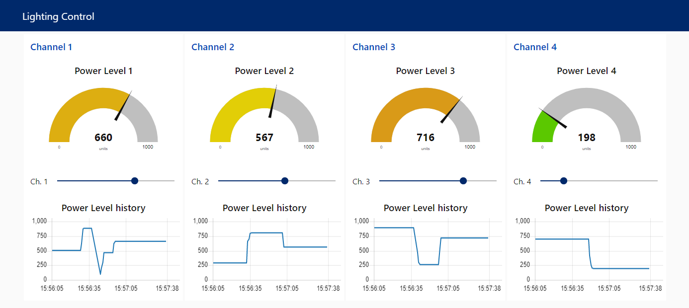
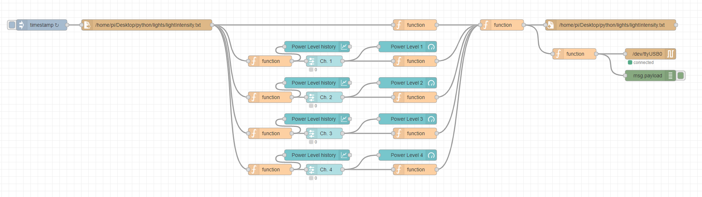
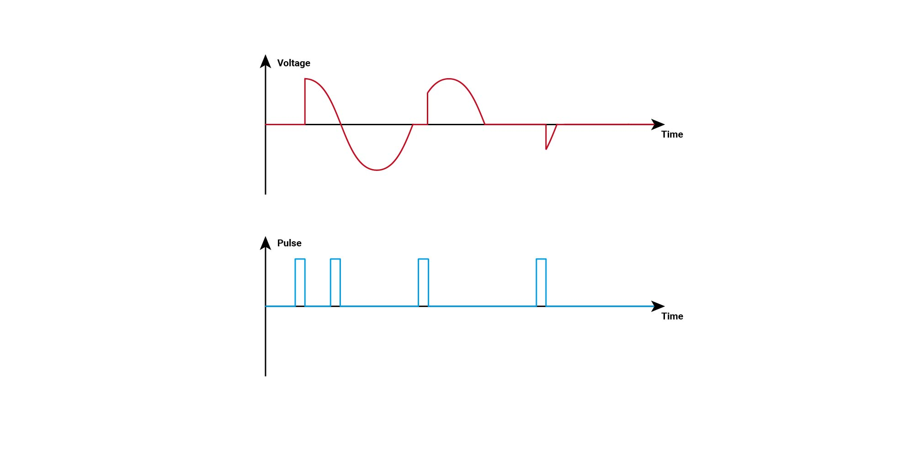

# 4ChannelBAT16TRIACControl
An integrated IoT (Internet of Things) solution for controlling 4-Channel BAT16 TRIAC Board. This project is part of [ProgrammableIoTEnvironmentChamber](https://github.com/JiaweiHe98/ProgrammableIoTEnvironmentChamber).

## Overview

### Web Dashboard

The solution is capable to control four dimmer channels simultaneously.

### Node-Red Flow

The design is able to control the power output for each channel independently.

### 3D Printed Control Box

The box can be compatible with fans range from 40mm to 70mm. It prevents electric shock caused by human contact and effectively dissipate the heat generated by the controller. For each of the base piece and the cover piece, a perfectly plain surface is designed to make the 3D printing process easier.

## Prepare for Developing
This section will guide you through the software and tools required for building this project.

### Visual Studio Code
Visual Studio Code, also known as VSCode, is a popular and powerful text editor for developers. A good text editor is crucial for speeding up the coding process and debugging process.

#### Install Visual Studio Code
We recommend to use the official website for downloading the packages.
Please go to [https://code.visualstudio.com/](https://code.visualstudio.com/) and follow the instruction on the web page.

#### Recommended Extensions
We recommend you to install the listed extensions for boosting your coding experience with VSCode
* Arduino
* C/C++
* Python
* vscode-icons

### Arduino IDE
Arduino IDE is a open-source integrated development environment designated for all Arduino boards. We will use this software to compile our code and burn it to our Arduino. It also has a serial monitor which allows us to interact with Arduino through serial communication.

#### Install Arduino IDE
We also recommend to use the official website for downloading the packages if you are on a Windows or MacOS machine.
Simply go to [https://www.arduino.cc/en/software](https://www.arduino.cc/en/software) and find out your version.
If you want to use a Raspberry Pi or a Linux machine to program the Arduino, you can simply update your software list by ```sudo apt-get update``` and install Arduino IDE by ```sudo apt-get install arduino``` in your console.

### Python
Python is a widely used program language and both python2 and python3 interpreters are pre installed into Raspberry Pi OS and MacOS.

#### Install Python3 for Windows
Go to [https://www.python.org/downloads/](https://www.python.org/downloads/) and choose the version you prefer. Don't forget to add PATH for python interpreter.

#### Install pyserial package
pyserial can be installed through command line with pip. Type ```pip install pyserial``` to add pyserial library.

### Node-Red
Node-Red is a visual programming tool based on Node.js. It allows you to edit working flows inside a web browser through a wide range of nodes and deploy your flow by simply click deploy button on the right top corner.

#### Install Node-Red
If you are using Raspberry Pi and you chose "Raspberry Pi OS with desktop and recommended software", Node-red is already installed into your Raspberry Pi. Simply click the start button on the top-left and go to programming tab. Then, you will able to find Node-Red.

If you are using a Windows machine, you first need to install Node.js and nmp. Go to [https://nodejs.org/](https://nodejs.org/) and download for Windows. Run the MSI file as administrator. Accept the default settings while installing. When finishing the installation, type ```node --version; npm --version``` in Powershell or ```node --version && npm --version``` in cmd to make sure that your installation is completed.

You should see something similar to this:
```
v14.15.3
6.14.9
```

Then, install Node-Red through ```npm install -g --unsafe-perm node-red``` and add ```node-red``` to your system path.

If you are using Linux, you can install Node-Red with npm, docker, or snap. You can follow the [Documentation](https://nodered.org/docs/getting-started/local) on Node-Red official website.

## Start Developing

### Phase Angle Control
Phase Angle Control is also known as "Phase-fired control (PFC)". Its principle is to modulate a thyristor or a TRIAC to control the amount of voltage, current or power flow into the controlled systems. 

#### Rectified voltage curve through Phase Angle Control

This project uses a BAT16 TRIAC as the device for modulate the voltage. The TRIAC will be turned on when the pulse arrive and stays on until the voltage is flipped.

### Detect Zero-Crossing points
The Zero-Crossing Points are the exact time that the AC voltage reaches zero. We first need to use a full bridge rectifier to convert AC into DC. Then we will use a optocoupler to drop the voltage from 120V or 220V to around 5V, which allows us to use an Arduino to process the signal through digital input.

#### Hardware interrupt for Arduino
The kind of interrupt we are going to use is also known as external interrupts. However, not all of the pins on the Arduino support external interrupts. For Arduino UNO, only PIN2 and PIN3 and be used as external interrupt. You can check out [attachInterrupt() - Arduino Reference](https://www.arduino.cc/reference/en/language/functions/external-interrupts/attachinterrupt/) for more information.

#### Code for external interrupt
Syntax ```attachInterrupt(digitalPinToInterrupt(pin), ISR, mode)```

| Mode | Description |
| ------ | --------- |
| LOW | to trigger the interrupt when the pin is low |
| CHANGE | to trigger the interrupt when the pin state flips |
| RISING | to trigger the interrupt when state goes from low to high |
| FALLING | to trigger the interrupt when state goes from high to low |
| HIGH | to trigger the interrupt when the pin is high (only support Due, Zero, and MKR1000)


Code for this project:

```C
// Define the pin number as a variable will make the developing process easier and less likely to make mistakes
int zeroCrossing = 2; 

void setup() {
  // Initialize external interrupt
  attachInterrupt(digitalPinToInterrupt(zeroCrossing), sequenceStart, FALLING);
}
```

#### Firing pulse
BAT16 needs 500ns of pulse to be switched on. Firing the pulse can be defined as a function and we need to assign output pins.
```C
// Channel number to pin number
int ch1 = 8;
int ch2 = 9;
int ch3 = 10;
int ch4 = 11;

void setup() {
  // Initialize output pin
  pinMode(ch1, OUTPUT);
  pinMode(ch2, OUTPUT);
  pinMode(ch3, OUTPUT);
  pinMode(ch4, OUTPUT);
}

void loop() {
  //Don't need anything here for control the states of the pins

}
```
Firing function
```C
void firing(int chNum, bool state) {
  if (state) {
    digitalWrite(chNum, HIGH);
  } else {
    digitalWrite(chNum, LOW);
  }
}
```
You may notice that we did not use a delay function inside the firing the function. This is because that we need to control four channels in the same time. We cannot let the firing process block our code.

### Serial Communication
Serial communication allow us to send our settings to the Arduino and also let the Raspberry Pi to monitoring the working status of the Arduino.

#### Setup Serial Communication
On Raspberry Pi:
```Python
import serial

# The first argument specify the serial port of the device
# Usually 'COMx' for windows, 'dev/ttyUSBx' for Raspberry Pi
arduinoData = serial.Serial('COM1', 115200)
```

On Arduino:
```C
void setup() {
  // opens serial port, sets data rate to 115200 bps
  Serial.begin(115200);  
}
```

#### Transmitting Data
From Raspberry Pi to Arduino
```Python
arduinoData.write(str(power_set).encode())
```
From Arduino to Raspberry Pi
```C
void sendPower() {
  Serial.print("[");
  for (int i = 0; i < 4; i++) {
    Serial.print(power[i]);
    if (i < 3) {
      Serial.print(",");
    }
  }
  Serial.println("]");
}
```
We only need to exchange the power levels for four channels so that we can arrange the power level into a Python list or an array. In python, we can use ```str()``` function to convert a list to a string. In arduino, we can define a small function to do the same job.

#### Receiving Data
On Raspberry Pi:
```Python
dataFromArduino = arduinoData.readline().decode('ASCII')[:-2]
power_read = eval(dataFromArduino)
```
Since we already arrange the data in the format of a Python list, we can use ```eval``` function to evaluate the string into a Python list. There will be a ```\n``` at the end of the data from Arduino. So, we can skip the last two letters.

On Arduino:
```C
void receivePower() {
  for (int i = 0; i < 4; i++) {
    power[i] = Serial.parseInt();
    timings[i] = map(power[i], 0, powerMax, 8100, 600);
  }
  bufferFlush();
  sendPower();
}
```
On Arduino we can use ```parseInt()``` function to get the settings from data sent by Raspberry Pi. ```parseInt()``` will skip the brackets and Brackets in between automatically. A serial buffer is designed to Arduino, we don't need to worry that the Arduino will miss the information sent by Raspberry Pi. We can also map the power level into the time "delay" to each zero-crossing time. We will never use a delay when multiple channels are working in the same time.

## Node-Red Dashboard

The gauges on the top show the current settings of each channel. The sliders below each gauge allow the users to assign new power level to each channel. We divided the power level into 1000 units. The line charts below the sliders help the users to monitor the history of the settings.

### Real-time interaction with Python scrip and Arduino

False at the end of each line indicates that there is no difference between the user defined settings and settings stored on Arduino

## Inter-process communication
We use a file to handle inter-process communication. The light intensity settings can be easily read from a file or write to a file with plain text. Therefore, we use a .txt file to store our settings and also to be our API between the Python script and Node-Red. The .txt file only contains 4 lines of integers.

```
100
200
1000
0
```
